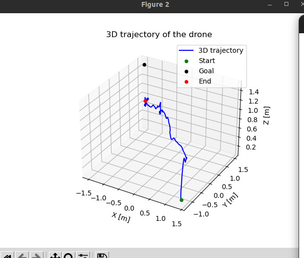
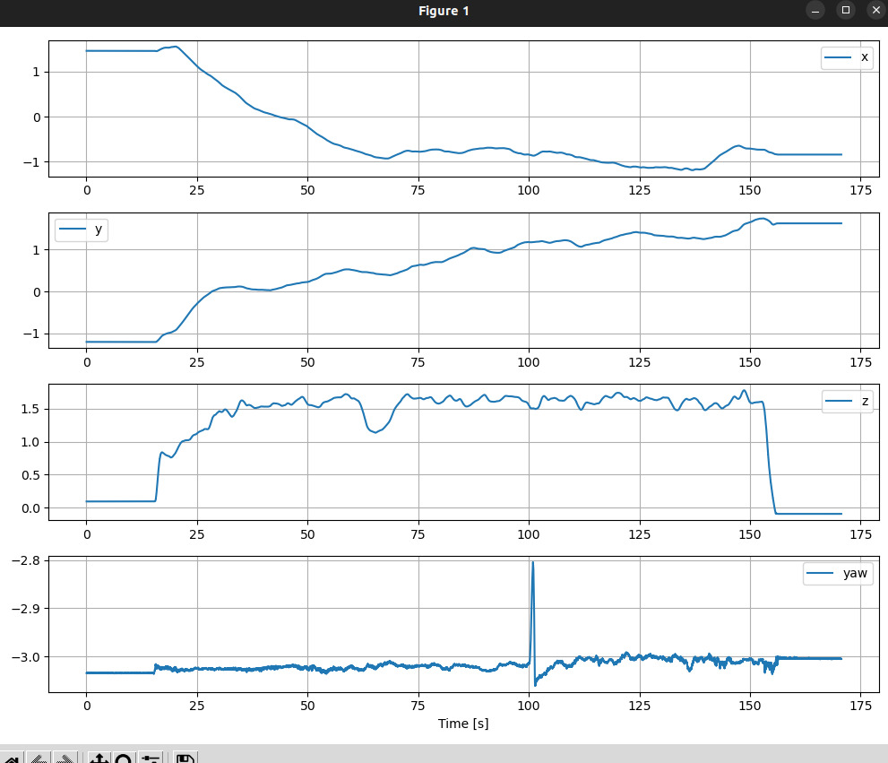

# Tello OptiTrack Control (ROS 2)

This project implements a **ROS 2** system for the kinematic control of a **DJI Tello** drone using position feedback obtained through an **OptiTrack** motion capture system.

## System Description

The current system uses a **Proportional (P) Controller** to guide the drone towards a desired point in space (Goal). 

**Performance Note:** By using only a P control action, the system achieves approximately **85% accuracy** in reaching the desired point. This is an expected behavior of a purely proportional controller (which is typically solved by implementing a PI or PID controller).

## ROS 2 Architecture & Node Communication

The project is divided into key packages and nodes that communicate via a Publisher-Subscriber architecture:

1. **OptiTrack Package (`natnet_ros2`)**: 
   * **Publishes:** `/drone/pose` (`geometry_msgs/PoseStamped`).
   * Fetches tracking data from the Motive server and sends it to the Linux PC. Please refer directly to the [natnet_ros2](https://github.com/L2S-lab/natnet_ros2) repository for specific configuration.
2. **Control Node (`cinematic_control`)**: 
   * **Subscribes to:** `/drone/pose` (to get the current drone position) and `/goal` (to get the desired target).
   * Calculates the P-control velocities and directly sends RC commands to the Tello drone over WiFi via the `djitellopy` library.
3. **Pose Plotter (`pose_plotter`)**: 
   * **Subscribes to:** `/drone/pose` and `/goal`.
   * Plots the trajectory and behavior of the drone in real-time, allowing visual evaluation of the controller's performance.

For deep technical details about our logic, coordinates, and development testing, please check the [Development Process Document (docs/DEVELOPMENT.md)](docs/DEVELOPMENT.md).

## Dependencies & Requirements

To run the nodes in this package, you need both **ROS 2** installed (and configured) and some Python libraries.

The main Python dependencies have been listed in a separate `requirements.txt` file. You can install them by running:

```bash
pip install -r requirements.txt
```

The specific Python libraries used are:
*   `djitellopy`: To connect to and send commands directly to the DJI Tello.
*   `scipy`: Handles spatial transformations like Euler-to-Quaternion (`Rotation`).
*   `numpy`: Used for array manipulation and matrices calculations.
*   `matplotlib`: Used in the `pose_plotter` node to generate the trajectory and coordinate plots.

*(Make sure you also have `rclpy` and `geometry_msgs` installed via your ROS 2 distribution).*

## Execution (ROS 2 Commands)

### 1. Running the System

You can run the control system and the graphs together using the launch file:

```bash
ros2 launch tello_control cinematic_with_plot.launch.py
```

Alternatively, you can run each node separately:

```bash
# Run the control node
ros2 run tello_control cinematic_control

# Run the pose plotter node (if needed separately)
ros2 run tello_control pose_plotter
```

*(Make sure the OptiTrack data is being published properly via the natnet_ros2 package).*

### 2. Sending a Goal Position
Once the system is running, you can send a goal to the controller by publishing a `geometry_msgs/PoseStamped` message. 

Example to move the drone to coordinates `x: -1.0, y: 1.0, z: 1.0`:

```bash
ros2 topic pub /goal geometry_msgs/PoseStamped "{pose: {position: {x: -1.0, y: 1.0, z: 1.0}}}"
```

## Results

Below is the plot of the final pose during a flight test. As you can see, the drone successfully makes the trajectory towards the target, but does not completely reach the exact goal, leaving a steady-state error. This behavior is expected when using only a Proportional (P) controller.



Furthermore, the graphs below show the individual coordinates (X, Y, Z) and the drone's position over time. While the drone smoothly approaches the desired coordinates, the small gap remaining before reaching the exact target confirms the typical performance limit of a simple P controller. This is completely normal for this setup.


