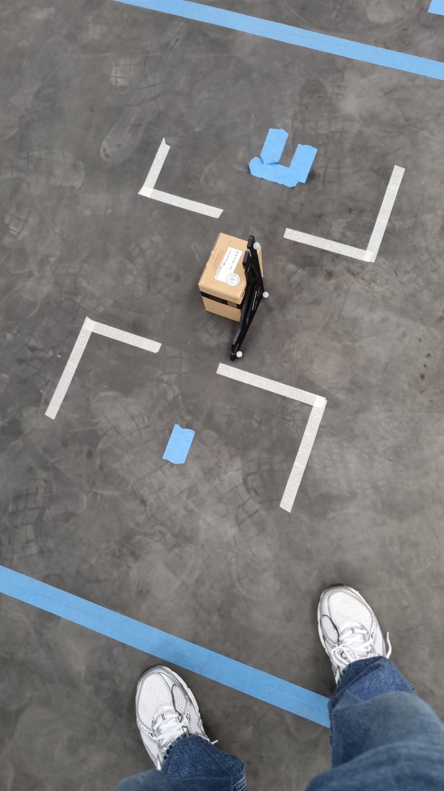
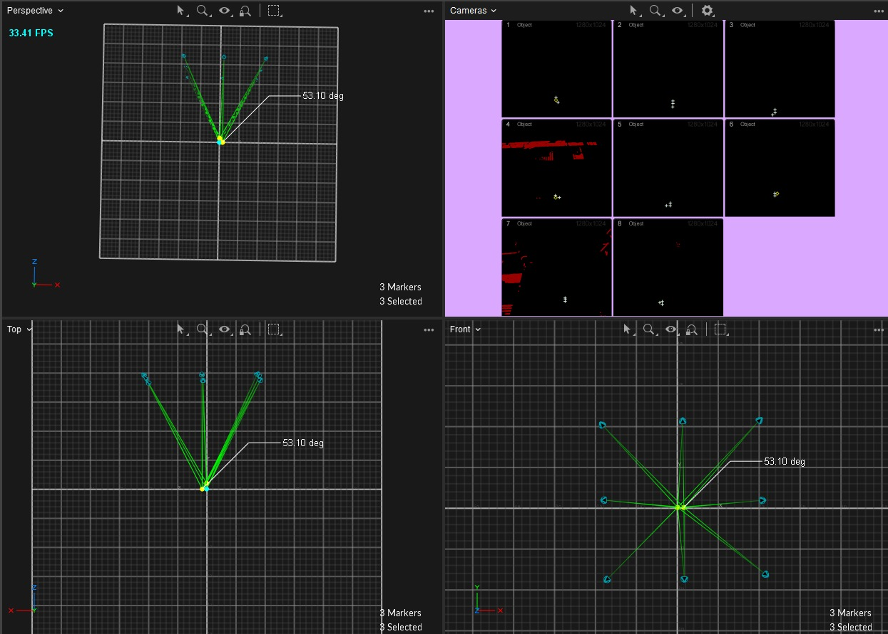
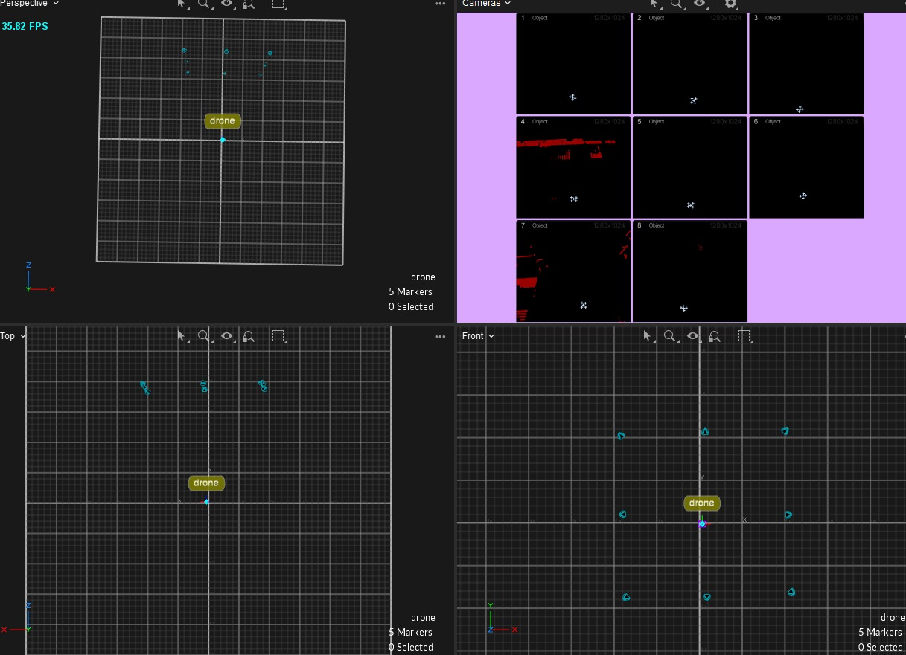

# Development Process and Experimental Setup

This document details the step-by-step process of configuring the OptiTrack system, the networking setup, the underlying mathematical logic for control, and how the experimental scripts were used during the development phase.

## 1. Experimental Setup (OptiTrack)

To ensure the drone's movements corresponded logically to the motion capture system, we had to carefully configure the physical space and the **Motive** software.

### Ground Plane and Axes
We adjusted the ground plane so that the axes aligned perfectly with the drone's expected behavior, preventing any confusion during flight commands:
*   **Z-axis:** Up / Altitude
*   **X-axis:** Right
*   **Y-axis:** Forward

*Setting the axes in Motive to match the drone's inertial frame.*

### Rigid Body Configuration
We created a custom Rigid Body inside the Motive software and explicitly named it `drone`. This step is crucial because the `natnet_ros2` package automatically maps the Rigid Body name to the ROS 2 topic name. Thus, the system publishes the data over `/drone/pose`.

## 2. Networking Setup

Since the system relies on real-time data streaming from a Windows PC running Motive to a Linux PC running the ROS 2 controller, a solid local network was established.

*   **Connection:** The two computers were connected directly via an Ethernet cable.
*   **Streaming Type:** The OptiTrack data stream was configured as **Unicast**.
*   **IP Configuration:**
    *   **Windows PC (Motive):** `192.168.1.1`
    *   **Linux PC (ROS 2):** `192.168.1.2`

## 3. Data Structure and Mathematics

### Data Transformation
The Linux machine receives the data as standard ROS 2 `geometry_msgs/PoseStamped` messages. 
By default, orientation data from OptiTrack and ROS is represented using **quaternions**. To make the control logic easier to understand and apply, we converted these quaternions into **Euler angles** (Roll, Pitch, and Yaw).

### The Rotation Matrix
A crucial part of our kinematic control is the use of a 2D rotation matrix based on the drone's **Yaw** angle (rotation around the Z-axis). 
The velocity calculations are initially mapped to the global inertial frame (the room). However, if the drone is facing backward but needs to move "forward" in the global frame, it must know how to translate that global vector into internal frame commands. 
The rotation matrix calculates exactly what speeds need to be sent (in its intrinsic axes) for the drone to move correctly regardless of where it is currently facing.

### Proportional (P) Control Logic
The core of the kinematic control is a **Proportional (P) Controller**. The logic evaluates the error between the desired target position (goal) and the current position provided by OptiTrack in real-time:

$$Error = P_{Goal} - P_{Current}$$

The control algorithm multiplies this error by a proportional gain constant ($K_p$) across each axis to determine the exact velocities to send to the drone:

$$Velocity = K_p \times Error$$

This means the drone will move faster when it is far from the target and will smoothly slow down as it approaches the goal. Because the velocity decreases as the error approaches zero, the drone eventually lacks the "push" needed to completely close the gap. This mathematical limitation of a purely Proportional controller is the exact reason why the drone stabilizes slightly short of the exact coordinate, causing the ~85% accuracy steady-state error seen in our results graphs.

### Overriding RC Commands (Closed-Source Limitations)
It is important to note that the DJI Tello relies on closed-source, proprietary firmware. Because of this, we cannot send direct linear or angular velocity commands (e.g., $m/s$ or $rad/s$ directly to the motors). 

To solve this, we map our calculated P-control "velocities" into **RC (Remote Control) commands**. By continuously calling the SDK's `send_rc_control(left_right, forward_backward, up_down, yaw)` function, we overwrite the manual joystick inputs. Essentially, the ROS 2 node acts as an automated pilot that dynamically pushes the virtual joysticks based on the calculated error.

## 4. The `tests/` Folder

During the development process, various scripts were created inside the `tests/` folder to experiment, safely validate assumptions, and debug specific components of the system before deploying the full ROS 2 kinematic control.

Here is a breakdown of the experimental files:

*   **`checkAxis.py`:** Used to understand and validate how the OptiTrack space mapped to the Tello's physical movements.
*   **`checkYaw.py`:** A specific test to verify our logic regarding the rotation matrix and ensure the drone understood its orientation correctly within the inertial frame.
*   **`checkBattery.py` / `ConnectBattery.py`:** Utility scripts used to quickly check the drone's battery levels, a constant necessity during flight testing to prevent crashes.
*   **`connect_wifi.sh`:** A helper bash script used to speed up the connection process to the DJI Tello's local WiFi network.
*   **`height.txt` / `height_plotter.ipynb`:** Data dumps and a Jupyter Notebook used initially to plot and analyze specifically the drone's altitude (Z-axis) behavior before implementing the full 3D `pose_plotter` node.

## Safety Warnings & Troubleshooting

### Safety Precautions
*   **Battery Level:** Always keep the DJI Tello battery above **50%**. Because we limit our control to a Proportional (P) gain, a low battery physically lowers the motor thrust. The drone will lack enough power to reach the target, worsening the steady-state error or failing to fly forward.
*   **Propeller Guards:** Make sure to fly with propeller guards while doing indoor OptiTrack testing to protect the motion capture cameras and the drone itself against unexpected maneuvers.

### Troubleshooting
*   **Drone is not receiving commands / Script fails:** Verify that your Linux PC is successfully connected to the Tello's internal WiFi network (`TELLO-XXXX`). Without it, the `djitellopy` library cannot send RC commands.
*   **No plot or tracking data received (`/drone/pose` is empty):** Check the local network bridge. Ensure the Ethernet cable is connected, the Motive PC is set to `192.168.1.1`, your Linux PC is `192.168.1.2`, and Motive is broadcasting as **Unicast**.